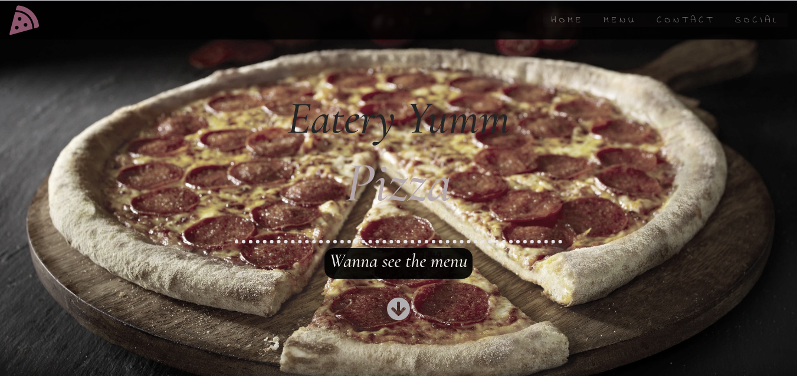

# Eatery Yumm  Pizza
#### By **Jason Githui**

## Description
This is an exclusive website project that satisfies customers needs of ideal pizza blends with a fine touch of high class ingredients where you get deliveries at your door step at an affordable price.
To view,click this link https://jasongithui.github.io/wk4-ip/
## Setup/Installation Requirements
* Create a folder
* clone this,
  git clone https://github.com/jasongithui/wk4-ip.git
* Open index.html in a browser.
* Enjoy the work.
## Known Bugs
There are no known Bugs.
If found,please contact me as soon as possible
## Technologies Used

Language used is HTML, CSS, JAVASCRIPT AND JQUERY.Styling initialised by Bootstrap and Google fonts.
## Support and contact details
For any questions, use my email jasongithui@gmail.com.
### License
MIT License

Copyright (c) 2020 Jason Githui

Permission is hereby granted, free of charge, to any person obtaining a copy
of this software and associated documentation files (the "Software"), to deal
in the Software without restriction, including without limitation the rights
to use, copy, modify, merge, publish, distribute, sublicense, and/or sell
copies of the Software, and to permit persons to whom the Software is
furnished to do so, subject to the following conditions:

The above copyright notice and this permission notice shall be included in all
copies or substantial portions of the Software.

THE SOFTWARE IS PROVIDED "AS IS", WITHOUT WARRANTY OF ANY KIND, EXPRESS OR
IMPLIED, INCLUDING BUT NOT LIMITED TO THE WARRANTIES OF MERCHANTABILITY,
FITNESS FOR A PARTICULAR PURPOSE AND NONINFRINGEMENT. IN NO EVENT SHALL THE
AUTHORS OR COPYRIGHT HOLDERS BE LIABLE FOR ANY CLAIM, DAMAGES OR OTHER
LIABILITY, WHETHER IN AN ACTION OF CONTRACT, TORT OR OTHERWISE, ARISING FROM,
OUT OF OR IN CONNECTION WITH THE SOFTWARE OR THE USE OR OTHER DEALINGS IN THE
SOFTWARE.
 **Jason Githui**
